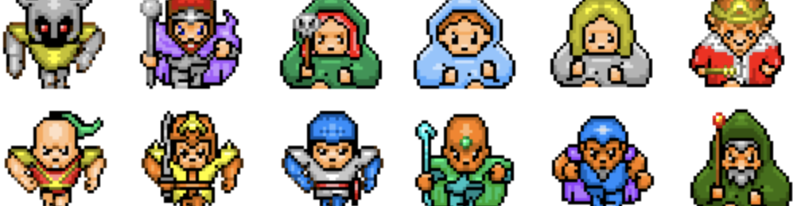

# gmk_asset
[](https://bakudas.itch.io/generic-rpg-pack)  

[](https://0x72.itch.io/dungeontileset-ii)  

[](https://arks.itch.io/dino-characters)  

[](https://cluly.itch.io/pico-rpg-forest-tileset)  

[](https://guttykreum.itch.io/field-of-green)  
 
 [](https://arktentrion.itch.io/pixel-rpg-asset-pack)  
 
 [](https://elthen.itch.io/2d-pixel-art-forest-tileset)  
 
 [](https://stonetrench.itch.io/another-pico-8-tileset)  
 
 [](https://delsin53.itch.io/pixel-tileset)  
 
 ```
 chỉ đi lên xuống, trái phải thôi :3
 ```  
 [](http://blogoscoped.com/files/last-guardian-sprites.zip)  

[](https://cluly.itch.io/pico-rpg-forest-tileset)  

[](https://rottingpixels.itch.io/sci-fi-tileset)  


```
chỉ đi lên xuống, trái phải thôi :3
```  
[](https://aztrakatze.itch.io/top-down-character-pack-4-directions)  

```
click vào từng nhân vật sẽ ra nhân vật đó
chỉ đi lên xuống, trái phải thôi :3
```  
[](http://untamed.wild-refuge.net/rmxpresources.php?characters)  
